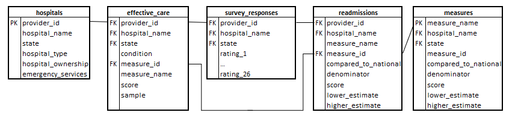

## Transforming
Call each transformation to prepare data for further investigation:
```
hive -f bulk_transform.sh
```
"bulk_transformation.sh" calls each individual SQL transformation which can also be run individually.

Alternatively, use spark-sql or hive-cli and run:
```
source effective_care_transform.sql
source hospitals_transform.sql
source measures_transform.sql
source readmissions_transform.sql
source survey_responses_transform.sql
```

The resulting transformations result in data following the entity-relationship diagram:

